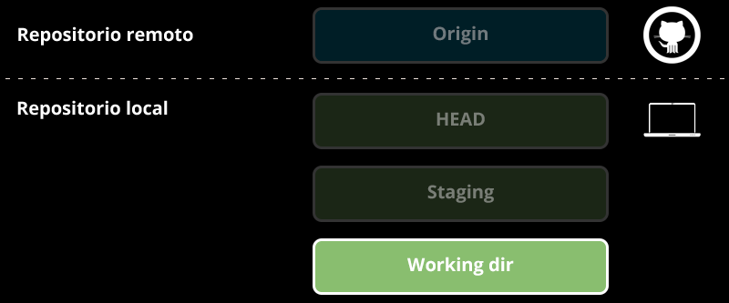
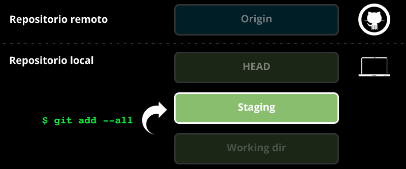
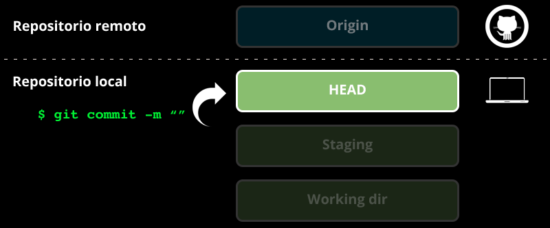
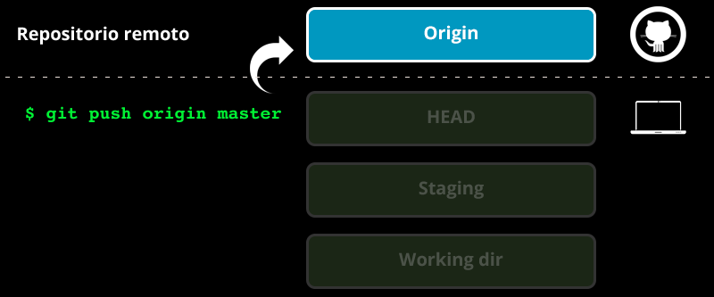
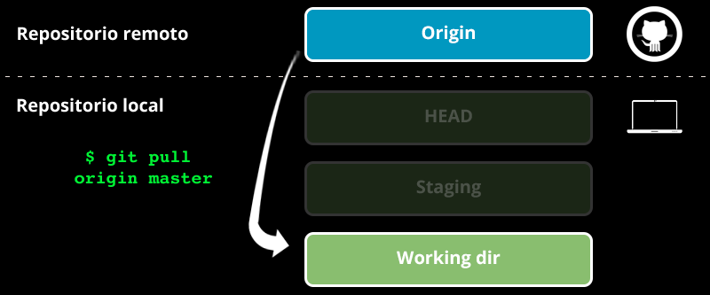

# _Git_

1. [Introducción](#introducción)
1. [Configuración inicial](#configuración-inicial)
1. [Flujo básico](#flujo-básico)
1. [De _master_ a _main_](#de-master-a-main)
1. [Otras tareas](#otras-tareas)
1. [_GitHub Pages_](#github-pages)
1. [Aprende más](#aprende-más)

---

## Introducción

#### Software de control de versiones

[_Git_](https://git-scm.com/) es un _software_ de control de versiones distribuido y descentralizado que permite a un equipo de desarrolladores trabajar sobre el mismo código.jkini

#### Control de versiones distribuido

Se denomina **"distribuido"** porque cada miembro del equipo dispone de una copia completa del código.

#### Control de versiones descentralizado

Los miembros del equipo pueden enviarse código, recibirlo y desarrollar funcionalidades de forma conjunta y separada del servidor central.


#### Ventajas de usar _Git_


- Estándar actual
- Código colaborativo, versionado y distribuido
- Recuperación de archivos
- Mayor control
- _Shorcuts_ y _plugins_
- Mejora tu productividad

#### Áreas de _Git_

1. **Directorio de trabajo:** Modificas una serie de archivos en tu directorio de trabajo.
1. **Área de preparación:** Preparas los archivos, añadiéndolos a tu área de preparación.
1. **Repositorio _Git_:** Confirmas los cambios, lo que toma los archivos tal y como están en el área de preparación y almacena esa copia instantánea de manera permanente en tu directorio de _Git_.

#### Plataformas _web_ que trabajan con _Git_

- [_GitHub_](https://github.com/)
- [_GitLab_](https://gitlab.com/)
- [_BitBucket_](https://bitbucket.org/)
- etc.


[👈🏻 Regresar](#git)

## Configuración inicial

#### Instalación

- [_Git_](https://git-scm.com/downloads)
- Interfaces gráficas:
  - [_Source Tree_](https://www.sourcetreeapp.com/)
  - [_GitHub Desktop_](https://desktop.github.com/)
  - [_Visual Studio Code_](https://code.visualstudio.com/#built-in-git)

#### Configurando _Git_ por primera vez

```git
$ > git --version
$ > git config --global user.name "Jonathan MirCha"
$ > git config --global user.email jonmircha@gmail.com
$ > git config --global user.ui true
$ > git config --global core.editor nano
$ > git config --list
$ > git help [comando a buscar]
```

#### Inicializar _Git_ en un directorio local

- **`git init`** crea un directorio oculto **`.git`** donde se almacena toda la información utilizada por _git_.
- El comando _UNIX_ **`touch`** nos crea un nuevo archivo.
- En el archivo **`.gitignore`** incluimos todo lo que NO queramos incluir en nuestro repositorio. Lo podemos crear manualmente o con [_gitignore.io_](https://www.gitignore.io/).
- **`git status`** nos muestra el listado de archivos nuevos (_untracked_), borrados o editados.

```git
$ > mkdir carpeta
$ > cd carpeta
$ > touch README.md
$ > touch .gitignore
$ > git init
$ > git status
```

[👈🏻 Regresar](#git)

## Flujo básico

El flujo se distribuye en tres estados locales y uno remoto:

#### Estados locales:

1. **_Working Directory_:** El directorio donde almacenamos los archivos.
1. **_Staging Area_:** El estado en el que avisamos a _Git_ de que hemos realizado cambios.
1. **_HEAD_:** El puntero hacia el último bloque de código (_commit_).

#### Estado remoto:

4. **_Remote Origin_:** El directorio remoto donde almacenamos los archivos en alguna plataforma _web_ como _GitHub_, _GitLab_, _BitBucket_.

### _Working Directory_

El primer nivel es nuestra carpeta de trabajo local en nuestra computadora. Podemos añadir, quitar, editar archivos y _Git_ sólo se encargará de controlar los archivos que han sido modificados.



Una vez creados, modificados, añadidos o borrados los archivos al **_working directory_** los pasamos al **_staging area_** mediante:

```git
$ > git add [nombre de archivo(s) o directorio(s)]
$ > git add --all //todos los archivos
$ > git add -A //shortcut todos los archivos
$ > git add . //otro shortcut todos los archivos
```

### _Staging Area_

En el segundo nivel nuestros archivos están preparados para ser empaquetados. Podemos seguir trabajando y repetir el proceso tantas veces como necesitemos.



Cuando hemos completado un conjunto de cambios, los "empaquetamos" mediante la instrucción **_`commit`_** y los colocamos en el **_HEAD_** mediante:

```git
$ > git commit -m "mensaje descriptivo"
```

### _HEAD_

Nuestro conjunto de cambios está listo para enviarse al repositorio remoto. El **_HEAD_** es nuestra "bandeja de salida". Podemos seguir trabajando y crear más "_commits_".



### _Remote Origin_

Ahora vincularemos nuestro repositorio local con uno remoto en _GitHub_.

Una vez creado el repositorio remoto en _GitHub_ lo "vinculamos" a nuestro repositorio local mediante:

```git
$ > git remote add origin https://github.com/usuario/repositorio.git
```

Una vez indicando a _Git_ que tenemos un repositorio remoto podemos enviar el conjunto de cambios contenidos en nuestro **_HEAD_**. Por defecto _Git_ denomina **_origin_** a nuestro repositorio remoto y crea una rama llamada **_master_** mediante:

```git
//la primera vez que vinculamos el repositorio remoto con el local
$ > git push -u origin master

//para las subsecuentes actualizaciones
$ > git push
```



[👈🏻 Regresar](#git)

## De _master_ a _main_

Con los desafortunados acontecimientos del 25 de mayo de 2020 en los Estados Unidos que culminaron con el asesinato del afroamericano [_George Floyd_](https://es.wikipedia.org/wiki/Muerte_de_George_Floyd) a manos de policias de la ciudad de _Mineápolis_, se intensificó de manera global el movimiento [_#BlackLivesMatter_](https://es.wikipedia.org/wiki/Black_Lives_Matter).

Con dicho movimiento muchas industrias y empresas comenzaron a tomar acciones para erradicar el racismo.

En la industria de la tecnología por años se han empleado palabras como _master_, _slave_, _whitelist_, _blacklist_ entre otras que actualmente no son bien vistas por el contexto y la semántica que implican.

Al respecto _Microsoft_ empresa propietaria de _GitHub_ decidió comenzar una campaña para reemplazar el nombre de la rama principal de los repositorios de _master_ a _main_; como lo han explicado en este [documento](https://github.com/github/renaming):

> "El 1 de octubre de 2020, cualquier nuevo repositorio que crees utilizará '_main_' como la rama por defecto, en lugar de '_master_'. Este cambio no afecta a ninguno de tus repositorios existentes: los repositorios existentes continuarán teniendo la misma rama por defecto que tienen ahora".

Este cambio implica agregar una par de líneas de comandos adicionales para crear la rama '_main_' y hacerla principal en el repositorio.

Entonces el flujo básico quedaría de la siguiente manera:

#### Para repositorios nuevos

```git
$ > git init
$ > git add .
$ > git commit -m "Primer commit"
$ > git branch -M main
$ > git remote add origin https://github.com/usuario/repositorio.git
$ > git push -u origin main
```

#### Para repositorios existentes

```git
$ > git branch -M main
$ > git remote add origin https://github.com/usuario/repositorio.git
$ > git push -u origin main
```

[👈🏻 Regresar](#git)

## Otras tareas

#### Sincronizando versiones

Antes de enviar nuestros cambios tenemos que bajarnos la última versión del repositorio remoto, obtenemos los últimos cambios de **_origin_** y los combinamos con la rama **_master_** o **_main_**.

Cuando obtenemos archivos del repositorio remoto a nuestra copia local, _Git_ obtiene todos los archivos nuevos que se hayan añadido y elimina los que se hayan quitado.

```git
//la primera vez que descargamos el repositorio remoto al local
$ > git pull -u origin master
o
$ > git pull -u origin main

//para las subsecuentes actualizaciones
$ > git pull
```



#### Clonar repositorios

```git
$ > git clone [url-repositorio]
```

#### Revisando el historial

**`git log`** nos permite conocer todo el historial de un proyecto, con la información de la fecha, el autor y id de cada cambio.

```git
$ > git log

//muestra en una sola línea por cambio
$ > git log --oneline

//guarda el log en la ruta y archivo que especifiquemos
$ > git log > commits.txt

//muestra el historial con el formato que indicamos
$ > git log --pretty=format:"%h - %an, %ar : %s"

//cambiamos la n por cualquier número entero y mostrará los n cambios recientes
$ > git log -n

//muestra los cambios realizados después de la fecha especificada
$ > git log --after="2019-07-07 00:00:00"

//muestra los cambios realizados antes de la fecha especificada
$ > git log --before="2019-07-08 00:00:00"

//muestra los cambios realizados en el rango de fecha especificado
$ > git log --after="2019-07-07 00:00:00 --before="2019-07-08 00:00:00"
```

#### Diferencias entre el _Working Directory_ y el _Staging Area_

```git
$ > git diff
```

#### Resetear

Podemos eliminar el historial de cambios del proyecto hacia adelante con respecto de un punto de referencia.

```git
//borra HEAD
$ > git reset --soft

//borra HEAD y Staging
$ > git reset --mixed

//borra todo: HEAD, Staging y Working Directory
$ > git reset --hard

//deshace todos los cambios después del commit indicado, preservando los cambios localmente
$ > git reset [commit]

//desecha todo el historial y regresa al commit especificado
$ > git reset --hard [commit]
```

#### Agregando modificaciones al último cambio

```git
//Sin editar el mensaje del commit
$ > git commit --amend --no-edit

//Editando el mensaje del commit
$ > git commit --amend -m "nuevo mensaje para el último commit"
```

#### Moverse en el historial

Podemos desplazarnos en el historial del repositorio hacia atrás o adelante en cambios o ramas , sin afectar el repositorio como tal.

```git
//cambiar a una rama
$ > git checkout [nombre-rama]

//cambiar a un cambio
$ > git checkout [id-commit]
```

#### Ramas

Una rama nos permite aislar una nueva funcionalidad en nuestro código que después podremos añadir a la versión principal.

```git
//crear rama
$ > git branch [nombre-rama]

//eliminar rama
$ > git branch -d [nombre-rama]

//eliminar rama (forzado)
$ > git branch -D [nombre-rama]

//listar todas las ramas del repositorio
$ > git branch

//lista ramas no fusionadas a la rama actual
$ > git branch --no-merged

//lista ramas fusionadas a la rama actual
$ > git branch --merged
```

#### Fusiones

Une dos ramas. Para hacer una fusión necesitamos:

1. Situarnos en la rama que se quedará con el contenido fusionado.
1. Fusionar.

Cuando se fusionan ramas se pueden dar 2 resultados diferentes:

- **_Fast-Forward_**: La fusión se hace automática, no hay conflictos por resolver.
- **_Manual Merge_**: La fusión hay que hacerla manual, para resolver conflictos de duplicación de contenido.

```git
//Nos cambiamos a la rama principal que quedará de la fusión
$ > git checkout [rama-principal]

//Ejecutamos el comando merge con la rama secundaria a fusionar
$ > git merge [rama-secundaria]
```

#### Etiquetas

Con esta opción _git_ nos permite versionar nuestro código, librería o proyecto.

```git
//crear una etiqueta
$ > git tag [numero-versión]

//mostrar información de una etiqueta
$ > git show [numero-versión]

//listar etiquetas
$ > git tag

//Sincronizando la etiqueta del repositorio local al remoto
$ > git add .
$ > git commit -m 'v1.0.0'
$ > git push origin [numero-versión]

//Generando una etiqueta anotada (con mensaje de commit)
$ > git tag -a "v1.0.0" -m "Mensaje de la etiqueta"
$ > git push --tags
```

[👈🏻 Regresar](#git)

## _GitHub Pages_

[**`gh-pages`**](https://pages.github.com/) es una rama especial para crear un sitio _web_ a tu proyecto alojado directamente en tu repositorio de _GitHub_.

- _URL_ del repositorio: **https://github.com/usuario/repositorio**
- _URL_ del sitio: **https://usuario.github.io/repositorio**

Para crear esta rama especial en _GitHub_ ejecutamos los siguientes comandos:

```git
$ > git init
$ > git add .
$ > git commit -m 'Creando sitio web en GitHub Pages'
$ > git branch gh-pages
$ > git checkout gh-pages
$ > git remote add origin https://github.com/usuario/repositorio.git
$ > git push origin gh-pages

//Para descargar los cambios del repositorio remoto al local
$ > git pull origin gh-pages
```

[👈🏻 Regresar](#git)

## Aprende más

- [Git - La guía sencilla](http://rogerdudler.github.io/git-guide/index.es.html)
- [Libro Pro Git](https://git-scm.com/book/es/v2)
- [Guías Oficiales de GitHub](https://guides.github.com/)
- [Try GitHub](https://try.github.io)
- [Video tutoriales básicos](https://www.youtube.com/watch?v=ES2xtLyI-B8&list=PLmUnyBCRHkvUPkrsseI1SmMtYgfc-f8Kn)


[👈🏻 Regresar](#git)
